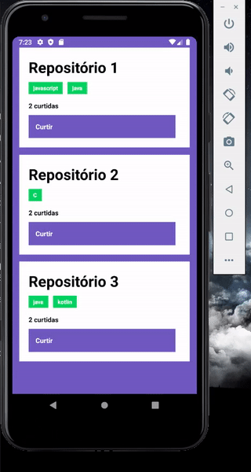

# Conceito-ReactNative
Desafio sobre os conceitos de React Native aplicados no Bootcamp GoStack.  
Este projeto é um projeto Mobile, desenvolvido com ReactNative SEM a utilização do Expo.
Utilizando o projeto https://github.com/LucasnDomingues/Conceito-Nodejs, que é a API Rest que fornece os dados para esta aplicação.
Foi feito um App que lista os repositórios criados na API, e permite que o usuário deixe likes. É importante ressaltar que os likes
não são somente visuais, estamos fazendo um método POST, mudando os likes do projeto pela API.

